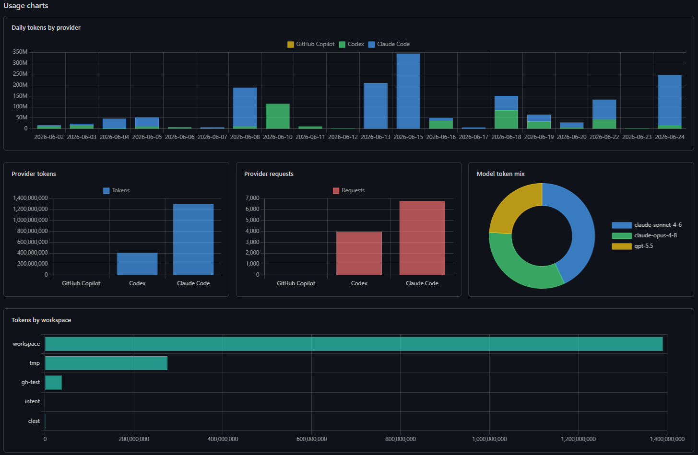
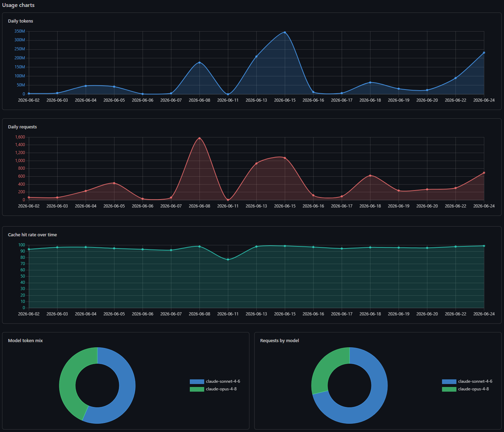
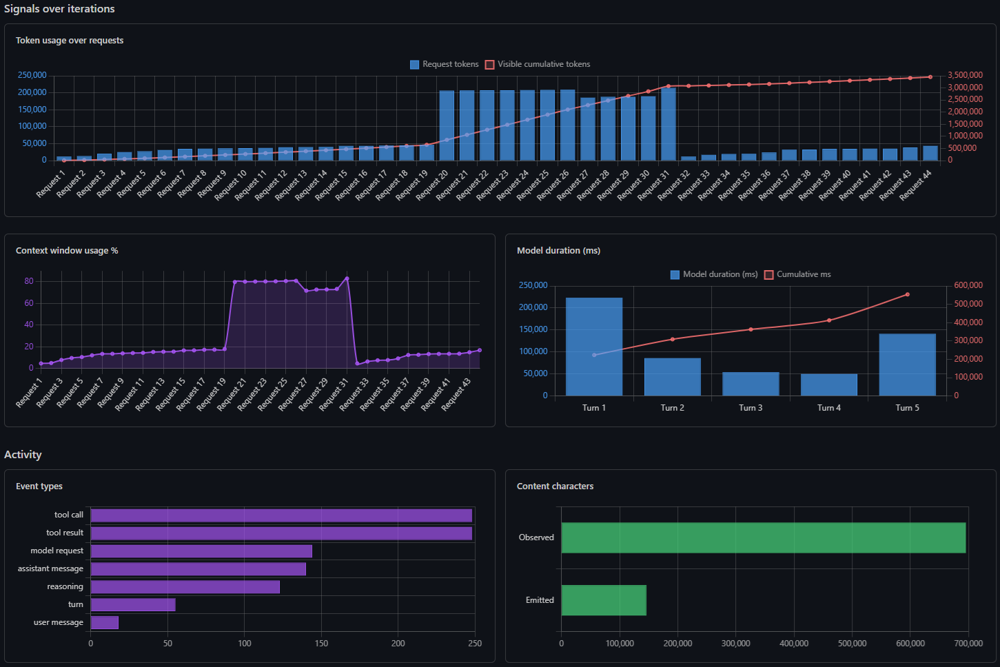
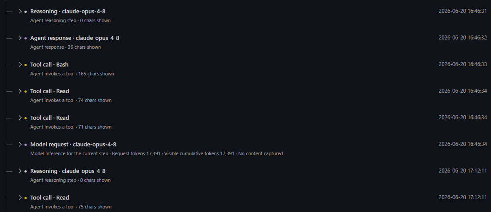

# Breadcrumbs

See where your coding-agent tokens actually go. Breadcrumbs is a Visual Studio Code extension that turns the GitHub
Copilot, OpenAI Codex, and Anthropic Claude Code logs already on your disk into usage dashboards and per-chat breakdowns
-- entirely locally. Your prompts and code never leave the machine.

## Why Breadcrumbs

- **Local only.** It reads files already on disk and never uploads anything. The persisted index keeps allowlisted
  metadata only -- captured prompts and tool output stay out of the cache, and content is suppressed in Restricted Mode.
- **One place for three agents.** Copilot, Codex, and Claude Code side by side, with provider-scoped totals (token
  semantics differ per provider, so Breadcrumbs never guesses a unified bill).
- **From the big picture down to one request.** Provider overviews, a searchable chat inventory, and a per-chat action
  tree with per-request and cumulative token development.

## Quick Start

1. Download the latest `.vsix` from the [Releases](https://github.com/goeselt/breadcrumbs/releases) page.
2. In Visual Studio Code, run **Extensions: Install from VSIX...** and select the downloaded file.
3. Open **Breadcrumbs** from the Activity Bar.
4. Run **Breadcrumbs: Refresh Usage Index**.

Requires Visual Studio Code `1.120.0` or newer. No account, API key, or network access required.

## What You Get

### Provider overviews

Daily tokens and requests, reasoning- and cache-share trends over time, model and workspace breakdowns, token
composition, and index health -- per provider or across all of them.

### Chat details

Open any chat for a token-composition breakdown, per-iteration signals (cache, output, context-window usage), and a
collapsible action tree of user messages, model requests, reasoning, tool calls, results, and subagent runs.

### Feature summary

- Provider readiness and source diagnostics, including a guided Copilot telemetry setup.
- Provider-specific usage, model, cache, token, and quality overviews with charts.
- Chronological chat inventory with provider-maintained or derived titles, plus a searchable **Open Chat** quick pick.
- Per-chat action tree and per-request / cumulative token development.
- Incremental local indexing with parser diagnostics and stale-result fallback, so refreshes after the first run are
  fast.
- Structured diagnostic log ("Breadcrumbs Log" in the Output view); verbosity via **Developer: Set Log Level...**.

## Further Reading

- [Data sources](docs/data-sources.md) -- which files each provider exposes and how they are discovered.
- [Chat details](docs/chat-details.md) -- how the action tree and bounded content view are built.
- [Terminology](docs/terminology-cheat-sheet.md) -- chats, sessions, subagents, and token terms.

## Contributing

See [CONTRIBUTING.md](CONTRIBUTING.md) and [LICENSE](LICENSE).
